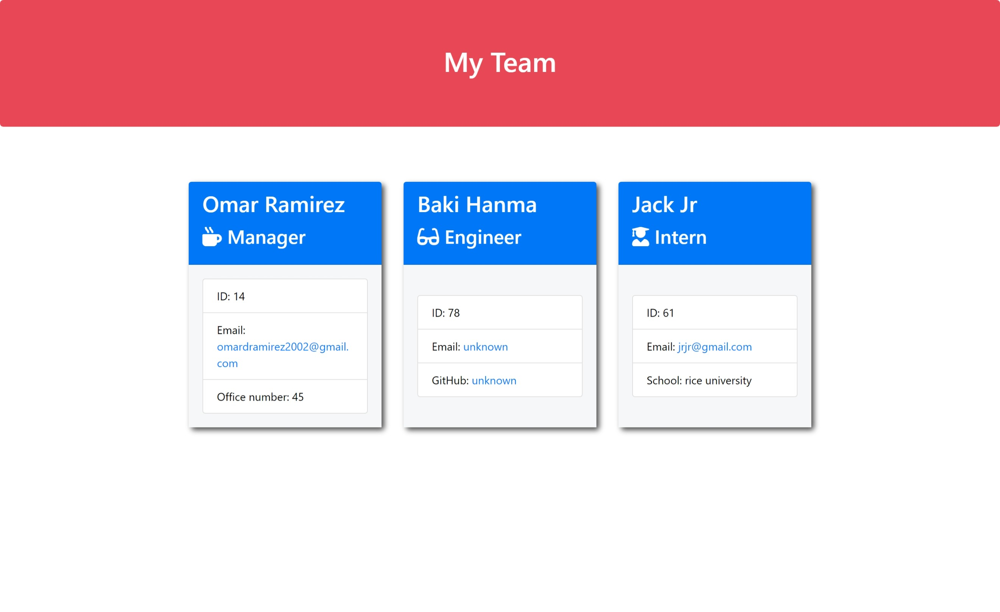

# Team_Generator
[](https://opensource.org/licenses/MIT)  

## Table of Contents

* [Description](#Description "Goto Description")
* [Installation](#Installation "Goto Installation")
* [Usage](#Usage "Goto Usage")
* [Contributions](#Contributions "Goto Contributions")
* [Tests](#Tests "Goto Tests")
* [Questions](#Questions "Goto Questions")
- - - -


## Description

This repository allows the user to generate team cards onto an html file through command prompts. 

## Installation

This allows the user to see the team from a simplistic view. The project is created using node.js, fs, and inquirer. The application must be forked and cloned onto your local machine. Afterwards, go into the project and in the outermost folder run the command npm i
````
npm i
````


## Usage

Once you have installed everything, go inside the terminal and run the command, "node inquirer.js". This will create a pop-up of prompts for your team. After completing the questions go into the output folder, find your html file and open it in browser. From there you can always go back into the terminal and go through the questions again in order to redo.



## Contribution Guidelines

John had helped me debug the an issue of the test cases not being read near the start of the project.

Link to his github below:

[John's Github](https://github.com/ESThing64)


## Tests

No tests


## Licence

This application uses [License: MIT](https://opensource.org/licenses/MIT)


## Questions

To see more of my projects visit my page below:

[My GitHub](https://github.com/BossyLemon0)

If you have any questions you can contact me through my email:

omardramirez2002@gmail.com

[Back to Top](#Team_Generator "Goto top")
